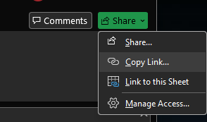
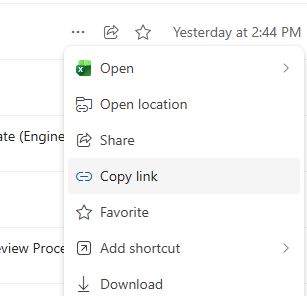
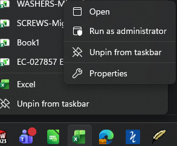
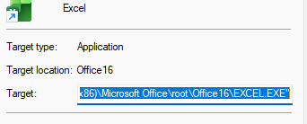
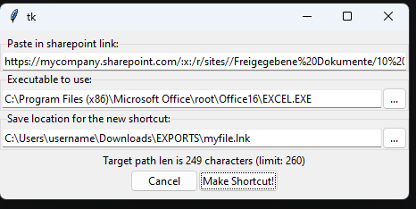

# OnedriveShortcut
How to make a desktop shortcut to open an online onedrive / sharepoint / teams file using local program (instead of web app).

- [Manual method](#manual)
- [Using my python program](#python)
- [Using my excel macro](#excel)
- [Using powershell](#powershell)

# Doing it manually:

First: get the link from onedrive / sharepoint / teams / whatever. There are many ways to get the link. Some common ones are to use the "Share" button on the top right or using the triple dot submenu on onedrive. Copy this link into a notepad window.

This link will look like this:\
`https://mycompany.sharepoint.com/:x:/r/sites/folder/Freigegebene%20Dokumente/Engineering%20and%20Quality/20260406%20-%20Release.xlsx?d=wcf834d7961874029a50a85c803123dec&csf=1&web=1&e=J6aby0`

Remove the "query" portion of the link, that is everything after the "?". Then manually unescape the URL quoting, for example replacing all the instances of "%20" with a space. Now your link should look like this:\
`https://mycompany.sharepoint.com/:x:/r/sites/folder/Freigegebene Dokumente/Engineering and Quality/20260406 - Release.xlsx`

Next: find the location of the program you want to use to open this. In my example I want to use Excel, so I need to find the excel executable. Find a shortcut to excel (eg in your start menu or on your toolbar), right click, and select properties.

The path will look something like this:\
`C:\Program Files (x86)\Microsoft Office\root\Office16\EXCEL.EXE`

Now you can build the target command. Put the program path and the file link in double quotes, separated by a space. The final command looks like this:\
`"C:\Program Files (x86)\Microsoft Office\root\Office16\EXCEL.EXE" "https://mycompany.sharepoint.com/:x:/r/sites/folder/Freigegebene Dokumente/Engineering and Quality/20260406 - Release.xlsx"`

IMPORTANT!! Windows has a target command length limit of 260 characters. This is not affected by the registry change that allows long paths in other parts of the system. If your final complete command is longer than 260 characters you will need to make a batch (.bat) file instead of a shortcut file.

To make the target into a shortcut, right click in any folder, select New > Shortcut, and paste the target command in. Pay attention to if the entire command is pasted in. If the command is more than 260 characters windows will automatically clip off the end.

To make the target into a batch file, open notepad, paste the target command in, and save the file with a .bat filename. Note this will only work if you have disabled the windows default of hiding file extensions.

Done! You can now doubleclick the shortcut or the batch file to open the online file in your local desktop app.

# Using this python program:

Note: the python program is not affected by the 260 character limit.

Install python if you don't have it already. The best way is to run this command in the command line:

    winget install Python.Python.3.14 Python.Launcher

Download the `OnedriveShortcutMaker.pyw` file above. Double click the file to run it.\
Note: if you installed an unofficial version of python or if you have some python development tools installed (pycharm, vscode, etc) this may override the doubleclick to run feature. In that case you should use whatever dev tools you have to run the program.

Fill in the fields and done!

# Using this excel macro:

# Using powershell manually:

Note: the powershell method is not affected by the 260 character limit.

Follow the steps above to get the cleaned link and the target executable path. Then use these commands to make the shortcut, replacing my example link and target path of course:

    # 1. Create a COM object for the shell
    $WshShell = New-Object -ComObject WScript.Shell

    # 2. Define the path for the new shortcut file (.lnk)
    $Shortcut = $WshShell.CreateShortcut("$Home\Desktop\MyShortcut.lnk")

    # 3. Set the shortcut properties
    $Shortcut.TargetPath = "C:\Program Files (x86)\Microsoft Office\root\Office16\EXCEL.EXE"
    $Shortcut.Arguments = "https://mycompany.sharepoint.com/:x:/r/sites/folder/Freigegebene Dokumente/Engineering and Quality/20260406 - Release.xlsx"

    # 4. Save the shortcut to disk
    $Shortcut.Save()
